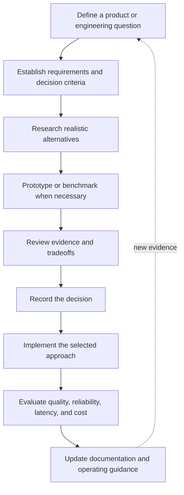
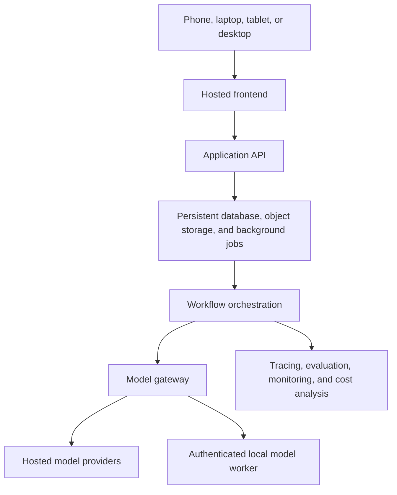

# ApplyGo

ApplyGo is an AI-native, human-supervised job-search and application platform designed for a hiring process that has already been transformed by artificial intelligence.

Candidates increasingly use AI to identify opportunities, interpret job requirements, improve resumes, draft application materials, and prepare for interviews. Employers increasingly use software and AI to search, filter, rank, summarize, and evaluate candidates. ApplyGo is designed around the reality that AI now operates on both sides of the hiring process.

The objective is not to automate every decision or remove the candidate from the process. The objective is to use AI wherever it can reliably reduce repetitive work, improve consistency, and surface better information, while reserving consequential judgments, approvals, and personal decisions for the human user.

ApplyGo should allow a candidate to spend less time searching fragmented career sites, comparing repetitive listings, rewriting the same material, copying information into forms, tracking application status, and monitoring correspondence. That time can instead be spent on activities that require human judgment: deciding which opportunities matter, confirming what is truthful, choosing how to present a career, preparing for conversations, developing skills, and determining whether a role is genuinely desirable.

This repository contains the deliberate, production-oriented implementation of ApplyGo. The earlier rapid prototype is preserved separately in `jasonsheinkopf/ApplyGo-prototype`.

---

## Why ApplyGo exists

The job-application process is no longer purely human-to-human.

A modern candidate may be evaluated by keyword filters, ranking systems, resume parsers, automated screening workflows, recruiter copilots, and AI-assisted review. At the same time, candidates have access to models capable of interpreting job descriptions, restructuring professional evidence, generating application materials, and automating repetitive interactions.

This shift is not temporary. The practical question is no longer whether AI should participate in the process, but how it should be used responsibly, effectively, and transparently.

ApplyGo is based on several principles:

1. **AI should perform repetitive work when it can do so reliably.** Re-entering the same information, comparing large numbers of listings, tracking application state, and producing first-pass document adaptations are poor uses of human attention.
2. **Humans should retain control over consequential decisions.** The user remains responsible for truthfulness, preferences, sensitive disclosures, final submissions, and communication sent in their name.
3. **AI-generated output must be measurable.** A system that produces persuasive text but cannot be evaluated, traced, or corrected is not dependable enough for high-impact use.
4. **The system must understand the candidate, not merely rewrite keywords.** Recommendations and generated materials should be grounded in structured evidence about the user’s actual history, skills, goals, and constraints.
5. **The product should optimize the whole workflow.** Job discovery, fit analysis, resume preparation, application execution, communications, and outcome tracking should share persistent context instead of operating as disconnected tools.
6. **Cost, quality, latency, privacy, and reliability are architectural concerns.** Different tasks may justify different models, providers, and execution environments.

ApplyGo therefore aims to be more than a resume generator, job scraper, or browser automation script. It is intended to become a durable decision-support and workflow platform for an AI-mediated hiring environment.

---

## The engineering approach

ApplyGo is not starting from the assumption that a custom platform must be built.

A responsible automation project begins by understanding the work as it exists today, quantifying the pain, evaluating existing products, and determining whether the problem is best addressed through configuration, integration, procurement, or custom development.

The intended path is:


This sequence matters because technical sophistication does not compensate for solving the wrong problem.

The first major deliverables are therefore not application code. They are:

- a current-state process map
- a value stream analysis
- quantified pain points
- a solution-landscape review
- a build-versus-buy assessment
- prioritized requirements
- measurable success criteria

---

## Current-state value stream

The following value stream map is an initial estimate of a serious, manually managed job-search workflow. The numbers are placeholders and should be replaced with measured data from real usage.

The purpose is not to claim precision. It is to make assumptions visible and establish a baseline that can later be validated.


### Initial waste and pain-point analysis

| Process step | Typical pain point | Likely waste type | Automation potential | Human involvement |
|---|---|---|---|---|
| Define target roles | Preferences are incomplete, inconsistent, or forgotten | Rework, ambiguity | Medium | Define and approve strategy |
| Identify companies | Candidate does not know every relevant employer | Search effort, missed opportunities | High | Review company relevance |
| Search career sites | Listings are fragmented across many company websites | Repetitive motion, waiting, overprocessing | Very high | Review exceptions |
| Filter listings | Many listings are irrelevant or duplicates | Overprocessing, information overload | Very high | Confirm borderline cases |
| Research role and company | Information is distributed across multiple sources | Search effort, context switching | High | Judge cultural and personal fit |
| Assess fit | Criteria are applied inconsistently | Rework, decision inconsistency | High | Make final prioritization decision |
| Tailor resume | Repeatedly reorganizing the same evidence | Rework, overprocessing | High | Verify truthfulness and emphasis |
| Tailor cover letter | Repeated drafting and copy-paste prompting | Rework, overprocessing | High | Approve tone and claims |
| Complete application form | Resume data must be entered field by field | Repetitive motion, defects | Very high | Handle exceptions and sensitive fields |
| Solve CAPTCHA | Intentionally requires human action | Waiting, interruption | Low | Complete challenge |
| Review and submit | Consequential external action | Risk control | Medium | Mandatory approval |
| Track application | Status is spread across notes, emails, and portals | Defects, lost information | Very high | Review meaningful changes |
| Monitor responses | Important messages may be missed or delayed | Waiting, task switching | High | Decide response |
| Prepare follow-up | Context must be reconstructed repeatedly | Rework, delay | High | Approve communication |

### Working baseline

For an active search involving ten serious applications per week, the current-state process may require roughly:

- **5-8 hours per week** discovering, reviewing, and prioritizing jobs
- **8-18 hours per week** researching roles and preparing tailored materials
- **5-10 hours per week** completing forms, re-entering data, and submitting applications
- **2-4 hours per week** tracking status, monitoring email, and following up

That suggests a provisional total of approximately **20-40 hours per week**, depending on application complexity and the level of customization.

These estimates will be revised using observed task timings rather than treated as established facts.

---

## Proposed future-state value stream

ApplyGo should not simply accelerate every existing step. It should redesign the workflow so repetitive work happens continuously in the background and the candidate is presented with focused decisions.

```mermaid
flowchart LR
    A[Candidate defines goals, evidence, and constraints]
    B[ApplyGo maintains structured candidate profile]
    C[ApplyGo identifies and monitors relevant employers]
    D[ApplyGo discovers, normalizes, deduplicates, and filters jobs]
    E[Candidate reviews ranked opportunities]
    F[ApplyGo prepares fit analysis and tailored documents]
    G[Candidate verifies claims and approves materials]
    H[ApplyGo prefills and navigates application workflow]
    I[Candidate handles CAPTCHA, sensitive fields, and final submission]
    J[ApplyGo records artifacts and monitors responses]
    K[Candidate reviews decisions requiring attention]

    A --> B --> C --> D --> E --> F --> G --> H --> I --> J --> K
    K -. preferences and outcomes improve future runs .-> B
```



The desired operating model is:

- the system performs high-volume search, comparison, normalization, drafting, tracking, and preparation
- the human receives a smaller number of clear, consequential decisions
- every external action remains visible and reviewable
- the system learns from approved corrections and outcomes
- persistent context eliminates repeated copy-paste work

The goal is not maximum autonomy. It is maximum useful assistance under explicit human control.

---

## Problem areas ApplyGo intends to address

### 1. Fragmented job discovery

Aggregators are useful, but they may be incomplete, delayed, duplicated, sponsored, or disconnected from the employer’s authoritative posting.

ApplyGo should identify relevant employers, monitor their official career sites on a recurring basis, normalize new jobs, remove duplicates, and present only roles that match the candidate’s actual constraints and interests.

### 2. Inconsistent job filtering

Candidates often repeatedly apply the same criteria manually: location, compensation, seniority, domain, work authorization, skills, travel, remote policy, and personal interest.

ApplyGo should convert these preferences into a persistent, editable search strategy and explain why each opportunity was included, excluded, or marked uncertain.

### 3. Repetitive application customization

General-purpose AI tools can already help rewrite resumes and cover letters. The problem is that the user still has to assemble context, copy and paste documents, repeat instructions, verify output, organize files, and remember which version belongs to which job.

ApplyGo should coordinate this end-to-end using persistent candidate evidence, job context, versioned documents, and human approval.

### 4. Re-entering structured information

Many application systems parse a resume and then require the user to correct or re-enter the same information field by field.

ApplyGo should maintain a structured, reusable candidate record, prefill fields where allowed, identify low-confidence entries, and leave CAPTCHA, legal declarations, sensitive disclosures, and final submission to the user.

### 5. Fragmented tracking and correspondence

Applications, documents, recruiter messages, portal updates, and interview actions are often spread across spreadsheets, inboxes, folders, and browser tabs.

ApplyGo should maintain a unified application history, connect every artifact to the relevant job, detect important responses, and surface the next decision or action.

---

## Solution-landscape research

Before committing to major implementation, the project will examine what already exists.

The landscape review should cover:

- job aggregators and recommendation platforms
- company-career-site monitoring tools
- resume optimization products
- cover-letter generators
- job-application trackers
- browser automation products
- automated application services
- email and recruiter-response tools
- open-source job-search agents
- general-purpose AI workflows assembled from existing platforms

Each candidate solution should be assessed against consistent criteria:

| Criterion | Questions |
|---|---|
| Coverage | Which parts of the value stream does it address? |
| Candidate understanding | Does it maintain durable, structured knowledge about the user? |
| Source quality | Does it use official employer postings or mainly aggregators? |
| Customization | Can behavior be adapted to nuanced preferences and constraints? |
| Human control | Are consequential actions visible and approval-gated? |
| Accuracy | Does it ground claims in verified candidate evidence? |
| Workflow integration | Are discovery, documents, applications, email, and tracking connected? |
| Reliability | Can failed or interrupted workflows resume safely? |
| Privacy | What candidate and employer data is retained or shared? |
| Cost | What are subscription, usage, and operational costs? |
| Extensibility | Can new models, tools, and workflows be added? |
| Transparency | Can decisions, prompts, actions, and outputs be inspected? |

The research should include product documentation, pricing, user reviews, community discussions, public demos, and open-source implementations. Findings should distinguish verified behavior from marketing claims and anecdotal complaints.

The purpose is not to prove that ApplyGo must be built. The purpose is to determine:

- whether an existing tool already solves the problem sufficiently
- whether several existing tools can be integrated
- whether only a narrow custom component is justified
- whether a broader custom platform creates meaningful value

---

## Build-versus-buy decision framework

The project should consider four legitimate outcomes:

1. **Buy or adopt an existing product** when it solves the workflow adequately at acceptable cost and risk.
2. **Integrate existing products** when the primary gap is coordination rather than missing capabilities.
3. **Build a focused custom component** when a specific high-value gap remains.
4. **Build the full platform** only when persistent context, end-to-end workflow control, customization, evaluation, privacy, or reliability cannot be achieved through existing options.

A custom implementation is justified only if the expected value exceeds the additional development, maintenance, security, and operational burden.

---

## Project history

### Phase 0: Rapid prototype

The first ApplyGo implementation was created through rapid AI-assisted development using Claude and ChatGPT.

The prototype was intentionally exploratory. Its purpose was to discover what the product should do, what users need to see, and where autonomous execution becomes unreliable.

It explored questions such as:

- Which parts of a job search are genuinely useful to automate?
- Which operations require explicit human approval?
- What information must remain visible while a workflow is running?
- How should generated documents and application state be presented?
- Where do browser agents and language models fail?
- What persistent data is needed across jobs, documents, and applications?

The prototype produced a partially working application and revealed important structural weaknesses:

- loosely defined workflows
- unclear application state
- insufficient visibility into system activity
- fragile execution
- limited failure recovery
- insufficient evaluation
- unclear prompt and model behavior
- incomplete separation between deterministic logic and AI judgment
- architecture that would require substantial rework before dependable use

The prototype is treated as a successful requirements-discovery exercise rather than the production foundation. It remains preserved in a separate repository so its ideas, failures, and interface concepts can inform the new system without constraining the architecture.

---

## Product philosophy

### AI where it is useful; human judgment where it is necessary

ApplyGo should automate analysis, organization, drafting, comparison, monitoring, and repetitive execution where those tasks can be performed reliably.

It should not silently make personal or consequential decisions.

**AI responsibilities**

- organize candidate information
- identify missing or conflicting information
- search and normalize jobs
- compare jobs with candidate preferences
- explain fit and uncertainty
- prepare tailored documents
- prefill repetitive application fields
- monitor application state and correspondence
- identify actions requiring attention

**Human responsibilities**

- verify truthfulness
- define and revise preferences
- resolve ambiguous career claims
- approve application materials
- answer sensitive questions
- make salary and relocation decisions
- approve external communications
- authorize submission
- choose whether a job is worth pursuing

### Deterministic workflows with agentic components

ApplyGo should not be implemented as one unrestricted agent improvising every action.

Most of the system should use explicit workflows, schemas, permissions, and state transitions. Language models and agents should be used where interpretation, judgment, planning, or recovery adds measurable value.

Deterministic responsibilities include:

- database updates
- duplicate detection
- hard eligibility rules
- document versioning
- state transitions
- required approval checks
- retry limits
- preventing duplicate submissions
- access control
- audit records

Model-powered or agentic responsibilities include:

- interpreting ambiguous career experience
- asking useful follow-up questions
- identifying evidence relevant to a role
- evaluating job fit
- adapting application materials
- interpreting unstructured employer communication
- navigating unfamiliar forms
- recovering from unexpected browser states

### Human supervision for consequential actions

Human approval should be required before actions such as:

- submitting an application
- agreeing to legal declarations
- answering sensitive demographic questions
- entering salary expectations
- sending recruiter messages
- creating third-party accounts
- uploading unreviewed documents
- withdrawing an application

The system should clearly display what it plans to do, what data it will use, and what will be sent externally.

### Evidence before persuasion

ApplyGo must not invent or embellish candidate experience merely because a statement would improve perceived fit.

Candidate claims should be linked to source evidence wherever practical, including:

- uploaded resumes
- user-provided descriptions
- structured interview answers
- portfolios
- project records
- previously approved profile facts

Generated resumes and application answers should distinguish among:

- verified facts
- user-confirmed interpretations
- inferred but reviewable conclusions
- missing information

### Model-agnostic architecture

The product should not depend on one model vendor.

Different tasks may use different local or hosted models based on measured quality, latency, privacy, availability, context requirements, and cost.

Provider-specific logic should remain isolated behind a model gateway.

### Evaluation from the beginning

Evaluation is part of the architecture, not a final testing step.

Each AI-powered capability should have:

- a clearly defined task
- versioned inputs and prompts
- structured outputs where appropriate
- representative evaluation cases
- objective and semantic metrics
- failure cases
- latency measurements
- token and monetary cost measurements
- a documented model-selection policy

### Documentation as part of completion

A feature is not complete merely because it works once.

Completion should include:

- implementation
- tests
- updated architecture documentation
- relevant decision records
- evaluation results
- known limitations
- failure analysis
- operational considerations

---

## Development and decision-making model

ApplyGo will be developed through an AI-assisted engineering workflow.

AI systems may perform research, compare technologies, propose designs, draft implementations, generate tests, analyze experiments, and prepare documentation. Architectural decisions remain evidence-driven and must be reviewed against explicit product requirements.



AI involvement should be transparent. The project should demonstrate disciplined use and supervision of AI-assisted engineering rather than conceal it.

---

## Documentation strategy

The repository will use Markdown documentation published with Material for MkDocs.

The README serves as the high-level product and architecture overview. As the project grows, detailed material should move into focused documentation areas:

```text
docs/
├── product/
│   ├── problem-statement.md
│   ├── current-state-value-stream.md
│   ├── future-state-value-stream.md
│   └── requirements.md
├── research/
│   ├── solution-landscape.md
│   └── build-vs-buy.md
├── roadmap/
├── architecture/
├── decisions/
├── experiments/
├── stages/
├── evaluation/
├── operations/
├── security/
└── failures/
```

### Architecture Decision Records

Important technical choices should use concise Architecture Decision Records.

Each decision should record:

- context
- requirements
- alternatives considered
- evaluation criteria
- selected approach
- rationale
- consequences
- validation plan
- conditions that would justify reconsideration

Research reports and decisions should remain separate. Research explains the available options. Decision records explain what was selected and why.

### Experiment records

Experiments should follow a consistent structure:

1. Question
2. Hypothesis
3. Method
4. Dataset
5. Metrics
6. Results
7. Decision
8. Limitations
9. Next action

### Failure records

Important failures should be documented when they reveal a reusable engineering lesson.

A failure record may include:

- observed behavior
- expected behavior
- root cause
- user impact
- detection method
- corrective action
- preventive controls

---

## High-level system vision

ApplyGo should ultimately operate as a hosted, device-independent application.

A user should be able to interact with the same persistent system from a phone, laptop, tablet, or desktop.



A local computer may optionally provide local inference through Ollama, but it should operate as an authenticated worker rather than being directly exposed to the public internet.

When a local worker is unavailable, the system should follow an explicit fallback policy:

- route to an approved hosted model
- wait until local execution is available
- fail clearly when a task is designated local-only

---

## Data and persistent state

ApplyGo must track information over long periods. A job may be discovered today, saved for a week, applied to later, and receive a response a month afterward.

Persistent product data should include:

- users
- candidate profiles
- career goals and preferences
- candidate evidence and claims
- uploaded source documents
- resume versions
- job-search strategies
- target employers
- discovered jobs
- normalized job records
- job evaluations
- generated documents
- applications
- approval records
- application history
- correspondence and responses
- tasks and notifications
- workflow runs
- model configurations
- evaluation results
- cost and usage records

A relational database such as PostgreSQL is the expected production default because the system is intended to support multiple users, multiple devices, concurrent workflows, and durable state.

Large files such as resumes, generated PDFs, screenshots, and browser artifacts should be stored in object storage, with metadata and ownership recorded in the database.

Application state and workflow execution state should be treated separately.

For example:

- the fact that an application is in an `INTERVIEWING` state belongs in the product database
- the fact that a workflow is paused before a human-review node belongs in workflow checkpoint storage

---

## Workflow orchestration

ApplyGo requires explicit state, long-running workflows, durable checkpoints, interruption for human review, resumable execution, and traceable node-level behavior.

LangGraph is a leading candidate for workflow orchestration because it is designed for these requirements. It is not permanently selected until the architecture phase compares it against realistic alternatives and records the decision.

The default principle is that workflow graphs act as the primary orchestrators. The system should not begin with a large hierarchy of loosely defined named agents.

Capabilities may later become agents or subgraphs when open-ended planning, independent tool use, or specialized recovery is justified by measured performance.

---

## Model gateway and routing

Business logic should not call a specific model provider directly.

Model-powered tasks should use a common request interface that describes:

- task type
- required capabilities
- output schema
- privacy policy
- quality tier
- latency requirement
- fallback policy

The model gateway should select a configuration using factors such as:

- measured task quality
- factuality
- schema reliability
- tool-use capability
- context requirements
- latency
- provider availability
- privacy
- token usage
- monetary cost
- local compute cost

Routing decisions should eventually be based on recorded evaluation results rather than intuition.

---

## Evaluation and observability

AI behavior must be observable and testable.

Potential capabilities include:

- prompt and model comparison
- trace inspection
- evaluation datasets
- model-based scoring
- deterministic scoring
- latency analysis
- token and cost analysis
- regression testing
- production monitoring

MLflow is a leading candidate for experiment tracking and evaluation. LangSmith and other realistic alternatives should also be researched where they address material requirements.

Evaluation data should combine:

- manually authored canonical cases
- synthetic cases
- difficult and adversarial cases
- real consented user cases

Synthetic output should not automatically be treated as unquestionable ground truth. Stronger evaluation combines deterministic metrics, independent model judges, and human review.

Useful deterministic metrics may include:

- schema validity
- required-field presence
- exact date accuracy
- duplicate rate
- unsupported claim count
- evidence-reference validity
- state-transition correctness
- retry behavior
- latency
- tokens
- cost

Useful semantic and human-evaluation criteria may include:

- usefulness of follow-up questions
- completeness of a candidate profile
- quality of resume recommendations
- job-fit reasoning
- relevance and clarity of generated materials
- user effort
- trust in generated output
- willingness to submit the result

---

## Security, privacy, and responsible automation

ApplyGo will handle sensitive personal and professional information.

The system should follow principles such as:

- minimum necessary data collection
- explicit ownership and access control
- encryption in transit and at rest
- secret management outside source control
- auditable external actions
- clear retention and deletion policies
- separation of development and production data
- human approval before consequential actions
- compliance with employer-site terms and applicable law

Automation should not be used to misrepresent qualifications, bypass access controls, evade CAPTCHA systems, spam employers, or submit applications without meaningful user authorization.

---

## Roadmap

### Phase 0 — Rapid prototype

**Status:** Completed and preserved separately.

- explore product behavior quickly
- validate basic feasibility
- identify useful features
- discover workflow and usability failures
- preserve findings without carrying forward fragile architecture

### Phase 1 — Process discovery and value stream analysis

- document the current job-search and application workflow
- measure task time, frequency, delay, rework, and error risk
- validate the initial value stream estimates
- distinguish value-adding decisions from repetitive work
- identify automation candidates and mandatory human checkpoints
- define current-state and future-state value stream maps

### Phase 2 — Solution-landscape and build-versus-buy analysis

- research commercial and open-source products
- compare capabilities, limitations, cost, privacy, and extensibility
- review user feedback and commonly reported failure modes
- determine whether existing tools can be adopted or integrated
- document the justification for any custom development

### Phase 3 — Product requirements and success criteria

- define target users and use cases
- prioritize pain points by value, feasibility, risk, and frequency
- establish functional and non-functional requirements
- define human approval boundaries
- define baseline and target metrics
- select the first production-worthy vertical slice

### Phase 4 — Architecture and engineering foundation

- configure Material for MkDocs
- establish repository conventions
- compare orchestration approaches
- define database and storage architecture
- design the model gateway
- establish observability and evaluation infrastructure
- define security and deployment boundaries
- record major decisions through ADRs

### Phase 5 — Candidate understanding

- ingest resumes and supporting documents
- build a structured candidate profile
- distinguish facts, interpretations, and missing information
- ask targeted follow-up questions
- track evidence and user approval
- evaluate factual consistency and completeness

### Phase 6 — Job discovery and prioritization

- define target-company strategies
- monitor official employer career sites
- normalize and deduplicate listings
- apply hard filters
- rank jobs using preferences and evidence
- explain fit, gaps, uncertainty, and priority
- store every job and evaluation persistently

### Phase 7 — Application-material generation

- generate job-specific resumes
- generate cover letters when useful
- prepare structured application answers
- prevent unsupported claims
- compare models and prompts
- measure quality, latency, and cost
- require user review before use

### Phase 8 — Application execution

- prefill repetitive fields
- navigate supported application systems
- detect uncertainty and request assistance
- pause for CAPTCHA and sensitive questions
- display all information before submission
- require explicit submission approval
- preserve receipts, screenshots, and final documents

### Phase 9 — Email and response management

- connect approved email sources
- associate messages with jobs and applications
- classify responses and required actions
- surface deadlines and interview requests
- prepare draft replies
- require approval before sending

### Phase 10 — Reliability and production readiness

- improve retry and recovery behavior
- add idempotency and duplicate-submission protection
- strengthen authentication and access control
- expand regression datasets
- monitor cost, latency, quality, and failures
- deploy a secure hosted environment
- validate multi-device and multi-user behavior

---

## Near-term deliverables

The immediate work is analysis and documentation rather than feature implementation.

1. Validate and revise the current-state value stream with measured timings.
2. Create a formal pain-point and automation-opportunity inventory.
3. Research the existing solution landscape.
4. Produce a build-versus-buy assessment.
5. Define prioritized product requirements and measurable outcomes.
6. Select the first production vertical slice only after the preceding evidence is reviewed.

---

## Current status

The rapid prototype is complete and preserved separately.

This repository is currently in the **process discovery and solution analysis** stage. Architecture and implementation decisions remain provisional until the value stream, solution landscape, requirements, and success criteria are documented.