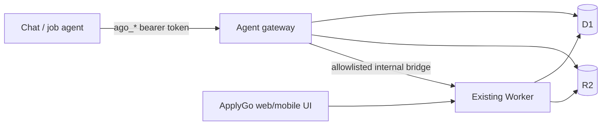

# Chat Agent API

ApplyGo now has a narrow agent-facing API so a trusted conversational agent can maintain the same candidate record the web/mobile UI uses.

The design rule is **one source of truth**. There is no chat-specific career database. Agent writes land in the existing Cloudflare D1/R2 model:

- `candidate_profiles` for candidate preferences and the generated structured profile
- `candidate_evidence` for factual notes and Career preference notes
- `source_documents` + the existing `FILES` R2 bucket for resume/supporting-document text
- existing Profile generation and Career analysis routes for derived data

The agent-specific tables contain only access-control, interview-progress, and audit metadata.

## Why this is a gateway instead of direct D1 access

A model should not receive a database credential or arbitrary SQL capability. The Worker is the policy boundary: it translates a small set of agent intentions into the same application data structures the UI already understands.



`cloudflare/src/agent-gateway.ts` is now the Wrangler entry point. Every non-`/agent` request is delegated unchanged to the existing `src/index.ts` Worker. This keeps the existing product behavior intact while adding the new surface independently.

## Security boundary

Agent credentials intentionally do **not** use `device_sessions`.

The existing app only distinguishes `read_only` from everything else; a new scope stored there would currently be treated like a full session by legacy routes. Instead, agent tokens are stored as SHA-256 hashes in `agent_credentials` and are recognized only under `/agent/v1/*`.

Properties:

- raw token prefix: `ago_`
- raw token returned once at creation
- only the hash is persisted
- expiration: 1–365 days, 90-day default
- independently revocable from `/agent`
- no Cloudflare API token, D1 credential, setup secret, or model-provider secret is exposed
- agent activity stores action names and short summaries, never raw resumes/notes or bearer tokens

Profile generation and Career analysis are existing ApplyGo actions rather than duplicated implementations. The gateway invokes only those two allowlisted legacy routes through a short-lived internal full session that is deleted immediately after the call. The external agent never sees that internal token.

## UI

A signed-in user can open `/agent` to:

- create an agent key
- copy the key once
- see and revoke active keys
- see current onboarding progress and the next interview question
- start a fresh interview

The gateway also injects a **Manage agent access** link into Settings > Devices on the existing dashboard, without modifying the large inline dashboard template in `index.ts`.

“Start fresh” is non-destructive. It resets only the interview confirmation flags. Existing documents, profile data, companies, jobs, applications, and generated artifacts remain in place.

## Agent API v1

All agent-data routes accept `Authorization: Bearer ago_...`. The same routes can also be used by a signed-in full dashboard session, which is how the `/agent` management page reads status.

### Read context

`GET /agent/v1/context`

Returns:

- profile summary and user-authored preferences
- source-document metadata
- Career preference notes
- factual notes
- whether a structured profile and role analysis exist
- interview confirmation flags
- ordered remaining questions
- a deterministic `next_action`

Use `?full=1` when the caller genuinely needs the complete structured profile and raw preferences.

Possible `next_action` values:

1. `continue_onboarding`
2. `generate_profile`
3. `analyze_careers`
4. `ready_for_job_search`

### Start or continue onboarding

`POST /agent/v1/onboarding/start`

```json
{ "mode": "fresh" }
```

`fresh` re-asks every onboarding topic without deleting canonical data. `continue` infers completed topics from the existing record.

`POST /agent/v1/onboarding/confirm`

```json
{ "topic": "extra_evidence" }
```

Use confirmation for a valid empty answer such as “no dealbreakers” or “nothing else to add.”

### Resume/supporting text

`POST /agent/v1/documents/text`

```json
{
  "name": "resume.pdf",
  "kind": "resume",
  "text": "extracted resume text..."
}
```

The gateway stores the content as a real `.txt` object in R2 and creates a normal `source_documents` row, so it appears in the existing Documents UI and is read by normal Profile generation. The filename is changed to `.txt` so the stored media type is never misrepresented as PDF/DOCX.

### Career preference notes

`POST /agent/v1/career-preferences`

```json
{ "text": "I want applied AI / agentic product engineering roles..." }
```

This writes the same `candidate_evidence.category='role_signal'` rows used by the Career UI. It invalidates stale derived role analysis.

### Search constraints and comparison priorities

`PUT /agent/v1/preferences`

```json
{
  "desired_locations": "Northern or Southern California, plus US remote",
  "dealbreakers": "Reject remote roles below ...",
  "care_about": "Compensation, remote policy, years required"
}
```

Only these user-authored fields are accepted. Existing unrelated preference keys are preserved. If a changed input makes `role_analysis`, `desired_roles`, or `care_about_topics` stale, the gateway removes those derived values so they are regenerated rather than silently reused.

### Factual evidence

`POST /agent/v1/notes`

```json
{ "text": "At Bosch I built ..." }
```

Writes the same normal `candidate_evidence.category='note'` data the Profile > Notes UI uses.

### Derived profile and career analysis

`POST /agent/v1/profile/generate`

```json
{ "provider": "anthropic" }
```

`POST /agent/v1/careers/analyze`

```json
{ "provider": "anthropic" }
```

These delegate to the existing `/profile/generate` and `/desired-roles/analyze` implementations through the private internal bridge.

### Credential management

These require a normal full ApplyGo dashboard session, not an agent token:

- `GET /agent/v1/tokens`
- `POST /agent/v1/tokens`
- `DELETE /agent/v1/tokens/:id`

`GET /agent/v1/activity` is available to either a full dashboard session or a valid agent credential.

## Initial interview contract

A fresh agent should ask these topics in order and write each answer immediately:

1. **Resume** — current resume/CV source text
2. **Career direction** — jobs/work the candidate wants next
3. **Locations** — remote/hybrid/onsite/relocation and geography
4. **Dealbreakers** — binding exclusions, including compensation/seniority if relevant
5. **Priorities** — facts the candidate wants surfaced when comparing jobs
6. **Extra evidence** — important career facts the resume omitted

After the six topics are confirmed, the agent follows `next_action`: generate the canonical structured profile, then analyze Career role families, then begin job discovery.

## Current product integration note

The Agent API is the stable backend contract; MCP is an adapter, not the data model. This matters because ChatGPT plan/surface support for custom write-capable MCP apps is still evolving. The existing ApplyGo MCP server remains read-only, while this API can be used by the Cloudflare integration now and by a future remote MCP/Apps SDK adapter without another schema redesign.
