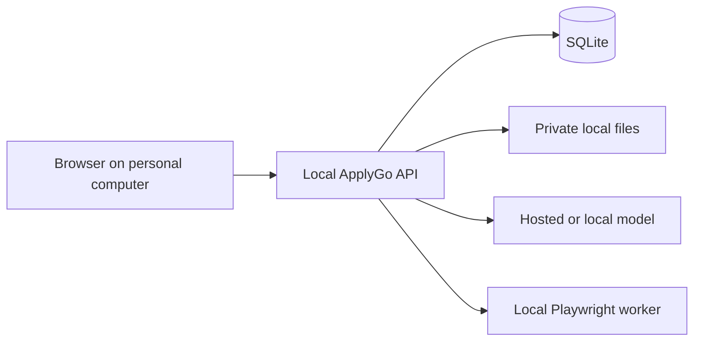
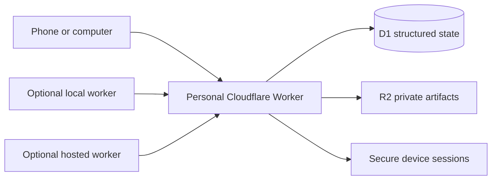

# Local and Cloudflare Dual-Mode Architecture

ApplyGo supports two first-class ownership models from the same repository.

## Local mode

Local mode is the default and lowest-friction path.



Private information remains under the gitignored runtime directory. No cloud account is required. This mode is appropriate when one computer is the primary device and the user accepts that workflows stop when the computer is off.

## Cloudflare personal-cloud mode

Cloudflare mode is an independently deployed personal control plane, not a centrally operated ApplyGo service.



Each installer owns the Cloudflare account, D1 database, R2 bucket, deployment URL, credentials, and costs. ApplyGo maintainers do not receive access to candidate data.

## Supported combinations

| Data plane | Execution plane | Use case |
|---|---|---|
| SQLite and local files | local Python worker | free desktop-only operation |
| D1 and R2 | local Python worker | portable phone control with execution when the computer is online |
| D1 and R2 | optional hosted worker | always-on execution later |

## Device enrollment

The prototype proved that entering a token once and remembering the phone is a good user experience. The production design preserves that experience but replaces the browser-stored GitHub personal access token.

1. An administrator creates a short-lived, one-time enrollment code.
2. The user opens the personal ApplyGo URL on a phone or computer.
3. The code is exchanged for a random device session token.
4. Only a cryptographic hash of that token is stored in D1.
5. The browser receives the token in a `Secure`, `HttpOnly`, `SameSite=Strict` cookie.
6. The device remains signed in until expiration or revocation.

The browser must never store Cloudflare API tokens, GitHub write tokens, model API keys, or encryption master keys in `localStorage`.

## Storage contract

Both modes implement the same conceptual contract:

- profile records
- candidate evidence and provenance
- source-document metadata
- jobs and normalized requirements
- assessments and model-run metadata
- device and worker registrations
- application and workflow events
- artifact references and checksums

Local mode maps this contract to SQLite and the filesystem. Cloudflare mode maps it to D1 and R2.

## Portability

The repository must provide a versioned export format so a user can move between modes:

```text
applygo-export/
├── manifest.json
├── records.ndjson
├── artifacts/
└── checksums.json
```

Exports must exclude deployment secrets and device-session tokens. Imports must validate schema version and checksums before changing live data.

## Security boundaries

- Cloudflare Access may be used as an additional outer login wall, but application sessions remain required.
- Device tokens are narrowly scoped to one personal deployment.
- Local-worker credentials are separate from interactive device sessions.
- Sensitive actions can require recent reauthentication even on a remembered device.
- Lost devices can be individually revoked.
- Public deployment is incomplete until authentication, authorization, retention, backup, deletion, and incident-recovery controls are validated.
