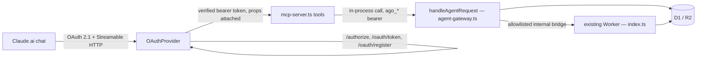

# MCP Connector (OAuth)

A remote [Model Context Protocol](https://modelcontextprotocol.io) server at `/mcp` on the
`applygo-prod` Worker, protected by a real OAuth 2.1 authorization server, so a Claude.ai chat can
connect to ApplyGo the same way it connects to Gmail or Cloudflare -- add a connector, sign in once,
then use tools in conversation.

This is deliberately a second thing from `mcp/`, the existing local server:

| | `mcp/` (existing) | `/mcp` (this document) |
|---|---|---|
| Transport | stdio (a local Node process) | Streamable HTTP (a real endpoint) |
| Auth | a manually-copied `read_only` device token | OAuth 2.1, dynamic client registration, a real consent screen |
| Client | Claude Desktop, Claude Code | Claude.ai web Connectors (or any remote-MCP client) |
| Capability | read-only, by construction | read + the write actions in `chat-agent-api.md`'s v1.1 slice |

Claude.ai's Connector UI cannot launch a local process or accept a token pasted into a config file --
it speaks OAuth to a URL. That's the entire reason this exists as separate infrastructure rather than
an upgrade to `mcp/`.

## How a tool call actually reaches D1



Nothing here duplicates business logic. Every MCP tool is a thin call into the exact `/agent/v1/*`
routes documented in `chat-agent-api.md` -- `mcp-server.ts`'s tools never touch D1, a model
provider, or a `candidate_evidence` row directly. The only new logic is the OAuth layer itself and
the mapping from "an approved grant" to "one `ago_*` agent credential."

## Why `@cloudflare/workers-oauth-provider`

Implementing OAuth 2.1 correctly -- PKCE, dynamic client registration (RFC 7591), the
`/.well-known/oauth-authorization-server` and `/.well-known/oauth-protected-resource` metadata
documents a client like Claude.ai discovers before ever showing a user a "Connect" button -- is a
lot of protocol surface to hand-rectify, and getting it subtly wrong (an accepted `plain` PKCE
challenge, a redirect URI that isn't exactly matched) is a real security bug, not a style choice.
This is Cloudflare's own purpose-built package for exactly "MCP server as OAuth provider," used in
Cloudflare's own remote-MCP examples for Claude/ChatGPT connectors. It only needs one new
binding (a KV namespace for grants/tokens/clients) and one new route it doesn't already know about
(`/authorize`, which by design it hands back to application code -- see below).

## Why no Durable Object

Cloudflare's `agents` SDK (`McpAgent`) is the common pattern for a remote MCP server, but it's built
for *stateful* agents -- a Durable Object per session, WebSocket-friendly, designed for a server
that needs to remember something between calls. None of ApplyGo's tools need that: every one of
them is already a stateless request against D1 through `agent-gateway.ts`. So this uses the MCP
SDK's `WebStandardStreamableHTTPServerTransport` directly, in "stateless mode" (no
`sessionIdGenerator`) -- a fresh `McpServer` and a fresh transport per HTTP request, exactly the
pattern the SDK documents for a serverless deployment. One less binding, one less moving part, and
nothing in the design gives that up: adding a stateful tool later is a reason to introduce a
Durable Object then, not a reason to add one speculatively now.

## What "props" actually carries

`OAuthProvider` attaches whatever `props` a grant was completed with to `ctx.props` on every
subsequent authenticated call to the `apiHandler`. Here that's:

```ts
type McpGrantProps = { agentToken: string; credentialId: string; label: string };
```

`agentToken` is a real `ago_*` credential -- minted at the moment of approval, the same way the
"Create agent key" button on `/agent` mints one, with the same hash-only storage and expiry. The
MCP layer never receives, stores, or forwards the OAuth access token itself into the Agent API;
it uses the `ago_*` credential exactly as an ordinary `ago_*`-authenticated HTTP client would.

## The `/authorize` step

`OAuthProvider` explicitly does not implement `/authorize` -- "This URL is used in OAuth metadata
and is not handled by the provider itself" is the library's own words for it -- so
`agent-gateway.ts` implements it: `GET /authorize` requires the browser to already hold a signed-in
ApplyGo dashboard session (the same cookie the website uses) and, if it does, renders a consent
screen naming the requesting client and what the grant allows and forbids. `POST /authorize`
records the decision; on approval, it mints the `ago_*` credential above and calls
`env.OAUTH_PROVIDER.completeAuthorization(...)`, which redirects back to the client with an
authorization code.

**Known limitation:** if the browser isn't already signed in to ApplyGo, `/authorize` shows a
"sign in first, then reopen this link" page rather than round-tripping back into the authorization
request after login. Acceptable for a single-candidate personal deployment; revisit if this ever
serves more than one signed-in user.

## One-time setup before this can deploy

This session has no Cloudflare credentials, so none of the following was run -- do this before
merging (or before the next deploy, if merging first):

1. **Create the KV namespace** the OAuth provider needs, once per environment:
   ```bash
   cd cloudflare
   npx wrangler kv namespace create OAUTH_KV --env=""
   npx wrangler kv namespace create OAUTH_KV --env production
   ```
   Paste the two returned ids into `wrangler.jsonc`, replacing `REPLACE_WITH_YOUR_OAUTH_KV_ID` and
   `REPLACE_WITH_YOUR_PRODUCTION_OAUTH_KV_ID` (same pattern as the existing D1 database id
   placeholder above them).
2. **Deploy.** `npm run release:production` (or merge this PR -- Cloudflare Workers Builds deploys
   `main` automatically, same as every prior release). No new secret is required: this layer only
   adds a KV binding, not a new API key.
3. **Add the connector in Claude.ai:** Settings -> Connectors -> Add connector -> paste
   `https://<your-worker-domain>/mcp` -> follow the OAuth prompt (this is the `/authorize` consent
   screen above) -> approve.
4. **Verify the metadata endpoints resolve** (useful when something's wrong before involving
   Claude.ai at all):
   ```bash
   curl https://<your-worker-domain>/.well-known/oauth-authorization-server
   curl https://<your-worker-domain>/.well-known/oauth-protected-resource
   ```

## Revoking access

An OAuth-issued `ago_*` credential is a normal row in `agent_credentials`, labeled
`Claude connector (<client name>)`. Revoke it from `/agent` exactly like any other agent key --
there is nothing OAuth-specific to clean up beyond that.
