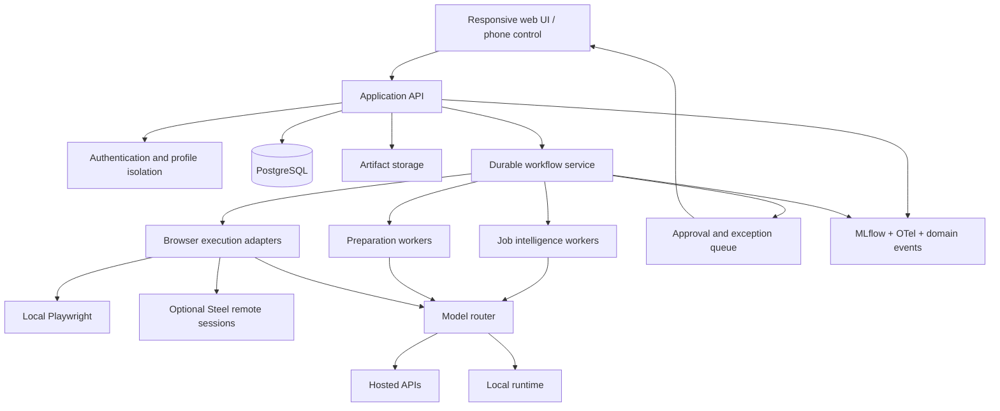

# Initial Recommendations

These are directional recommendations, not a claim that every selection is final.

## Recommend now

- build the permanent documentation and ADR system before application implementation
- use a modular monolith with explicit domain boundaries
- use typed Python domain models and structured model outputs
- adopt PostgreSQL as the intended production state store
- make Playwright the baseline browser engine
- design action-level policy gates and progressive autonomy from the beginning
- design the product to be phone-controllable while execution runs on durable workers
- keep model providers and browser runtimes behind adapters
- separate deterministic processing from model reasoning
- preserve evidence provenance for every generated claim

## Prototype before accepting

- local Playwright versus Steel.dev remote browser
- secure live-session handoff from phone
- LangGraph versus Temporal versus an explicit Python workflow
- MLflow tracing/evaluation ergonomics versus Phoenix or LangSmith
- local models versus hosted models for extraction, ranking, and generation
- ATS-family adapters and fallback browser reasoning

## Defer

- microservices
- Kubernetes
- high-volume multi-tenant SaaS concerns
- fully autonomous submission across unknown sites
- custom browser extension
- dedicated vector database separate from PostgreSQL
- a universal agent framework used for every component

## Do not recommend

- using an LLM for deterministic autofill values that normal code can supply
- storing workflow state only in an agent conversation or browser memory
- treating a consumer chat subscription as an application API
- allowing page content to grant tools, reveal secrets, or change system policy
- outsourcing the entire application lifecycle to an opaque autonomous applier
- hard-coding ApplyGo to Steel, LangChain, LangGraph, LangSmith, OpenAI, Anthropic, or any other single vendor

## Provisional reference architecture

