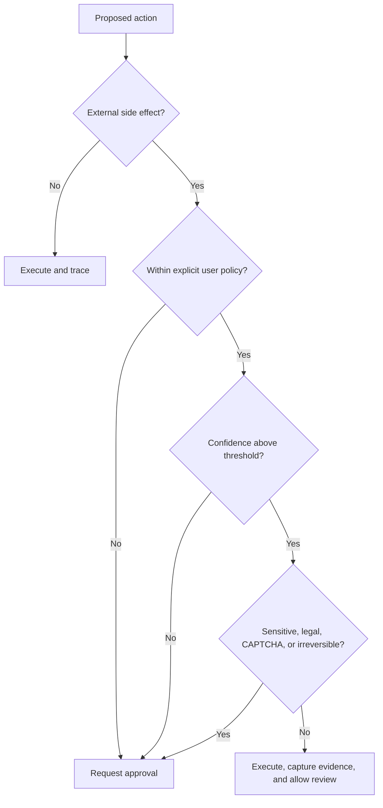

# Human, AI, and System Boundaries

ApplyGo should reduce human involvement progressively, but autonomy must be earned by observed reliability and explicit user policy.

## Human-reserved decisions

The following should require user action unless a later policy explicitly permits otherwise:

- confirming factual claims about experience, credentials, dates, compensation, and work authorization
- answering demographic, disability, veteran, criminal-history, conflict-of-interest, export-control, and legal-attestation questions
- agreeing to terms, declarations, signatures, or background-check consent
- solving or authorizing CAPTCHA and other site challenges
- sending communications in the user’s name during early autonomy levels
- final submission until the user enables a narrowly scoped auto-submit policy
- deciding whether a role is personally desirable

## AI-suitable work

- discovering and normalizing job listings
- deduplication and classification
- extracting requirements and constraints
- ranking with explanations and uncertainty
- retrieving verified candidate evidence
- preparing first-pass materials and form mappings
- navigating predictable application flows
- detecting exceptions and requesting exact missing information
- tracking artifacts, correspondence, deadlines, and outcomes

## Prohibited behavior

ApplyGo must not:

- invent qualifications or alter evidence to satisfy a job requirement
- disguise automation to circumvent a site’s stated restrictions
- purchase CAPTCHA-solving or anti-detection services without explicit configuration and legal/terms review
- reuse sensitive answers across applications without user-controlled policy
- submit when the page state, target employer, selected documents, or material answers are uncertain
- expose credentials or personal data in logs, prompts, screenshots, or traces

## Policy gates

Every consequential action should be represented as a policy evaluation, not an incidental UI prompt.

## CAPTCHA position

CAPTCHA is not merely a technical obstacle. It is an explicit signal that the site may require a human or is attempting to restrict automated access. ApplyGo should support several compliant responses:

1. pause and send a phone/desktop approval request with a live session link
2. hand control to the user in the existing browser session
3. use a supported remote-browser provider capability only when permitted and explicitly configured
4. abandon or defer the application when completion would require inappropriate circumvention

The default should be **human handoff**, not stealth bypass.
