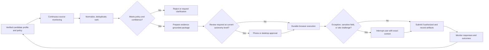

# Current-State Value Stream

This is a hypothesis-driven baseline for an active search. Timings must later be replaced with measured observations from real sessions.

## Current state

| Stage | Provisional effort | Main waste/risk | Automation suitability | Human role |
|---|---:|---|---|---|
| Define targets | 30–90 min per revision | ambiguity, forgotten constraints | medium | define strategy |
| Find employers and sources | 1–3 h/week | missed companies, fragmented sites | high | approve relevance |
| Search and normalize jobs | 2–5 h/week | duplicates, stale listings, inconsistent fields | very high | review exceptions |
| Research and fit assessment | 20–60 min/job | context switching, inconsistent criteria | high | judge personal fit |
| Tailor résumé | 30–90 min/job | repeated restructuring, unsupported claims | high | verify evidence |
| Prepare letter and questions | 20–60 min/job | repeated prompting and editing | high | approve voice and claims |
| Account and form completion | 20–60 min/job | re-entry, parser errors, authentication | very high | sensitive exceptions |
| CAPTCHA and site protections | unpredictable | interruption, anti-automation controls | constrained | complete or authorize |
| Final review and submission | 5–20 min/job | consequential external action | policy-dependent | approve initially |
| Tracking and email | 15–30 min/day | lost status, delayed response | very high | decide next action |
| Interview preparation | 30–180 min/event | context reconstruction | high | practice and decide |

For ten carefully prepared applications per week, a plausible baseline remains roughly **20–40 hours of human effort**. The important research task is to decompose that estimate into measured process time, waiting time, rework, and interruption frequency.

## Waste classification

- **Motion:** copying facts among résumé, ATS, spreadsheet, email, and AI chat
- **Waiting:** authentication, page loads, CAPTCHA, document generation, and delayed status updates
- **Overprocessing:** reformatting the same evidence and repeatedly researching the same employer
- **Defects:** parser errors, inconsistent dates, unsupported claims, wrong document versions
- **Inventory:** unreviewed jobs, drafts, unread email, and applications awaiting action
- **Context switching:** moving among tools that do not share state
- **Underused judgment:** spending human attention on transcription instead of selection and preparation

## Future state

The desired reduction is not merely faster clicking. It is fewer human interruptions, less repeated reconstruction, and better decisions from persistent evidence.

## Measurement plan

Instrument the prototype and future system for:

- human-active minutes per application
- number and duration of interruptions
- percentage of fields filled without correction
- number of unsupported generated claims
- application completion and abandonment rate by ATS
- recovery success after workflow failure
- cost and latency per completed application
- percentage of jobs rejected automatically with correct reasons
- candidate overrides of ranking and generated materials
- response and interview rates, treated cautiously because they are externally confounded
