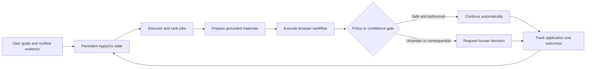

# ApplyGo Engineering Portal

ApplyGo is a personal, model-agnostic AI system for discovering, evaluating, preparing, executing, and tracking job applications. This portal records the product-discovery work, market research, operating model, technology options, and decisions that precede production implementation.

The project is proceeding because an integrated, user-controlled workflow is valuable for its intended users. Research is not being used to manufacture a conclusion that every component must be custom-built. It is being used to determine **what ApplyGo should own, what it should integrate, what can remain manual, and which assumptions must be tested before architecture is fixed**.

## Current conclusion

The strongest working thesis is that ApplyGo should be built as **personal AI infrastructure with progressive autonomy**:

- persistent candidate evidence, preferences, jobs, documents, applications, and outcomes belong to ApplyGo
- commodity capabilities such as model inference, browser runtimes, email, document conversion, and hosting should be replaceable integrations
- the system should begin with frequent human review and reduce interruptions only after measured reliability is demonstrated
- a phone should be able to control, review, and approve work, but need not execute the browser automation itself
- execution should be durable: workflows must pause, resume, expose state, and recover from failure
- model choice must not be hard-coded to one vendor



## How to use this portal

Start with [Problem and Product Thesis](discovery/problem-thesis.md), then read the [Current-State Value Stream](discovery/value-stream.md). The [Market Landscape](market/index.md) explains why products such as Simplify, general AI assistants, and autonomous application services are useful inputs rather than complete substitutes. The [Execution and Deployment](technology/execution-deployment.md) and [Browser Automation](technology/browser-automation.md) sections address local, hybrid, hosted, phone-controlled, CAPTCHA, and remote-browser choices.

## Evidence status

The portal distinguishes:

- **verified** — supported by an official source or direct observation
- **reported** — based on user or third-party reports
- **hypothesis** — plausible but not yet tested for ApplyGo
- **decision candidate** — recommended direction pending an ADR or prototype
- **decision** — accepted and recorded

Time estimates and architectural recommendations are provisional until they are validated through observed workflows and technical spikes.

## Local documentation preview

```bash
python -m venv .venv
source .venv/bin/activate  # Windows: .venv\Scripts\activate
pip install mkdocs-material
mkdocs serve
```

Open the local address shown by MkDocs. Full-text search, navigation, Mermaid diagrams, and cross-linked reports are enabled by `mkdocs.yml`.
