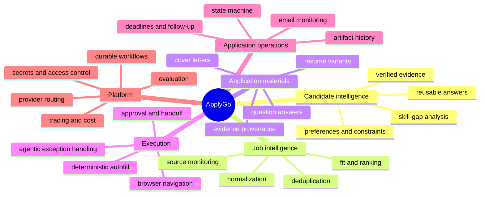

# Capability Map

## Bounded contexts

### Candidate Intelligence

Owns facts, evidence, goals, constraints, preferences, reusable answers, and user corrections. Other components reference evidence identifiers rather than copying untraceable prose.

### Job Intelligence

Owns sources, employers, raw postings, normalized jobs, duplicates, requirement extraction, and fit assessments.

### Application Preparation

Owns job-specific evidence selection, generated claims, document versions, answers, and approval state.

### Application Execution

Owns browser sessions, workflow steps, screenshots or DOM evidence, field mappings, exceptions, handoffs, and submission receipts.

### Application Operations

Owns the application lifecycle, communications, tasks, interviews, outcomes, and learning signals.

### Platform Services

Owns model routing, durable execution, evaluation, tracing, notifications, storage, authentication, policy enforcement, and secret isolation.

## Architectural implication

These boundaries should be represented clearly in code even if the first deployment is a modular monolith. Early microservices would add operational burden without proving the domain boundaries; a modular monolith with durable workers and explicit interfaces is the preferred starting point.
