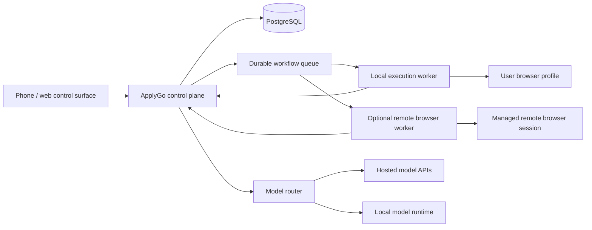

# Execution and Deployment Strategy

The central deployment question is not simply “cloud or local?” ApplyGo needs persistent state, independent execution, secure access to authenticated browser sessions, and low-friction intervention from a phone.

## Options

### Local-only

A desktop runs the API, database, workers, models or model clients, and browser.

**Advantages:** privacy, low cost, direct use of an authenticated browser profile, easy local-model access.

**Limitations:** stops when the machine sleeps, difficult remote access, fragile for scheduled work, and awkward for phone handoff outside the home network.

### Fully hosted

Cloud services run the application and remote browsers.

**Advantages:** always on, accessible from phone, scheduled execution, easier centralized operations.

**Limitations:** credentials and personal data move into hosted infrastructure; remote-browser identity, CAPTCHA, MFA, account security, and cost become harder; self-hosted simplicity is reduced.

### Hybrid — recommended target

A durable control plane stores state, schedules work, exposes the UI, and sends notifications. An execution worker may run on the user’s computer or against a remote browser provider. Models may be hosted or local.

The hybrid model supports a gradual path:

1. begin with everything on one computer through Docker Compose
2. expose a secure, authenticated web UI to the phone
3. move the database/control plane to an always-on host when needed
4. keep authenticated browser execution local where it is advantageous
5. add remote browser execution for scheduled and unattended workflows

## Phone requirement

The requirement should be **phone-controllable**, not necessarily phone-executed. Mobile operating systems and browsers restrict background work, extensions, long-running sessions, and arbitrary automation. The phone should provide:

- job and material review
- approval and exception responses
- live status and stop controls
- notification deep links
- secure browser-session handoff when supported

## Identity and browser profiles

Browser execution should use isolated profiles per user and environment. The architecture must not place two users’ cookies, autofill data, downloads, or screenshots in the same browser profile. Profiles should have documented backup, revocation, and reauthentication behavior.

## Minimum deployment recommendation

Start with:

- Docker Compose
- backend/API and worker processes
- PostgreSQL
- local artifact storage with an object-storage interface
- Playwright worker using a dedicated persistent profile
- secure web UI accessible on the local network or through a controlled tunnel
- optional hosted model APIs or Ollama-compatible local endpoint

Do not make Kubernetes, microservices, or a hosted remote browser mandatory before the workflow is validated.
