# Complete agent workflow

This document maps the workflow implemented by the Cloudflare Worker and D1 application in
`cloudflare/`. It is the most complete runtime in this repository. The smaller local Python
application has profile, job, and fit-assessment primitives, but does not implement the company
discovery, two-tier screening, or application-preparation flow shown here.

Solid arrows and borders are current behavior. Dashed arrows and nodes are planned behavior from
the product and roadmap documents. In particular, ApplyGo does **not** currently submit an
application, monitor messages, or model interviews, offers, or an accepted job.

## End-to-end workflow

```mermaid
flowchart TD
    START[User starts or revises a search]:::agent
    HUMAN_PROFILE[/Human: upload source documents, edit structured profile,<br/>add role signals, preferences, locations, dealbreakers, care-about text/]:::human
    PROFILE_EXTRACT[LLM_PROFILE_EXTRACT<br/>profile.structure]:::llm
    ROLE_DRAFT[LLM_ROLE_ANALYSIS<br/>roles.analyze]:::llm
    TOPIC_DERIVE[LLM_CARE_TOPICS<br/>fit.care_about_topics]:::llm
    MATCH_PROFILE[Deterministic buildMatchProfile<br/>structured_json to match_profile]:::code
    PROFILE_DB[(D1 profile/evidence store<br/>candidate_profiles<br/>source_documents<br/>candidate_evidence<br/>application_answers)]:::db

    COMPANY_TRIGGER{Human starts company discovery<br/>or adds companies manually}:::human
    COMPANY_LLM[LLM_COMPANY_DISCOVERY<br/>companies.discover]:::llm
    COMPANY_CHECK[Deterministic validation<br/>normalize URL and name; dedupe;<br/>locationMatches; verifyWebsite]:::code
    COMPANY_DB[(D1 companies<br/>durable watch list and scan metadata)]:::db

    SCAN_TRIGGER{Human starts board scan<br/>daily guard unless force=true}:::human
    BOARD_RESOLVE[Deterministic resolveBoard<br/>detect supported ATS and token]:::code
    ATS[(Official company ATS APIs<br/>Greenhouse, Lever, Ashby,<br/>SmartRecruiters)]:::external
    FETCH_JOBS[Deterministic fetchBoardJobs<br/>and fetchMissingDescriptions]:::code
    PRE_FILTER[Deterministic prefilter<br/>locationMatches and filterJobsByRoles]:::code
    DEDUPE{Unique company_id + external_id<br/>already stored?}:::code
    JOB_DB[(D1 job_postings<br/>listing, description, fit fields,<br/>human pipeline overrides)]:::db

    ASSESS_TRIGGER{Human clicks assess jobs}:::human
    QUICK_LLM[LLM_JOB_SCREEN<br/>fit.screen, cheap model, batches]:::llm
    QUICK_DECISION{screenJobsBatch result}:::code
    STRONG_LLM[LLM_JOB_FIT<br/>fit.assess, strong model, batches]:::llm
    FIT_MAP[Deterministic verdictForScore<br/>score to strong / possible / reject]:::code
    RECOMMENDED[Jobs UI: strong and possible<br/>score, reason, missing evidence, facts]:::agent
    HUMAN_JOB{Human review<br/>Interested or Reject}:::human
    FEEDBACK_DB[(D1 job_feedback<br/>only explicit user-written rejection reasons)]:::db
    REJECTED("REJECTED STATE<br/>Status: reject<br/>Score: 0<br/>Reason: human reason or Not a fit.<br/>Missing: retained<br/>Fit facts: retained<br/>Screened at: retained or null<br/>Assessed at: now<br/>Interested at: null<br/>Requirements: retained or none<br/>Resume ID: none<br/>Cover letter ID: none<br/>Applied at: null<br/>Outcome: rejected"):::terminal

    INTERESTED[Interested job<br/>fit_status=interested; original fit retained]:::agent
    GAP_QUESTION[LLM_REVIEW_QUESTION<br/>review.question]:::llm
    HUMAN_GAP[/Human answers job-specific gap question/]:::human
    REQUIREMENTS_LLM[LLM_REQUIREMENTS<br/>resume.requirements]:::llm
    BASE_LLM[LLM_RESUME_BASE<br/>resume.select_base]:::llm
    PLAN_LLM[LLM_EVIDENCE_PLAN<br/>resume.plan_evidence]:::llm
    RESUME_LLM[LLM_RESUME_COMPOSE<br/>resume.build]:::llm
    RESUME_RENDER[Deterministic grounding/layout checks<br/>HTML and PDF render to R2]:::code
    DESIGN_LLM[LLM_RESUME_DESIGN_REVIEW<br/>resume.design_review, image input]:::llm
    RESUME_DB[(D1 resumes + R2 PDF<br/>content, plan, checks, critique,<br/>layout, job_id)]:::db
    LETTER_LLM[LLM_COVER_LETTER<br/>cover_letter.write]:::llm
    LETTER_DB[(D1 cover_letters<br/>one generated HTML letter per job)]:::db

    MATERIAL_REVIEW{Human reviews generated<br/>resume and cover letter}:::human
    LIVE_FORM[/Human opens an application form<br/>with ApplyGo browser extension/]:::human
    FORM_MATCH[LLM_APPLICATION_MATCH<br/>application.answers]:::llm
    ANSWER_EXACT[Deterministic exact-answer reuse<br/>then extension fills matched fields]:::code
    SUBMIT_APPROVAL{Human reviews fields,<br/>sensitive answers, CAPTCHA,<br/>and submits on employer site}:::human
    EMPLOYER_ATS[(Employer application site)]:::external
    MARK_APPLIED{Human clicks Mark applied}:::human
    APPLIED("APPLIED STATE<br/>Status: applied<br/>Score: retained<br/>Reason: retained<br/>Missing: retained<br/>Fit facts: retained<br/>Screened at: retained<br/>Assessed at: retained<br/>Interested at: retained<br/>Requirements: retained or none<br/>Resume ID: present or none<br/>Cover letter ID: present or none<br/>Applied at: now<br/>Outcome: applied"):::terminal

    APP_HISTORY[(Planned application record,<br/>artifacts, submission receipt,<br/>status history)]:::planned
    STATUS_SYNC[Planned communication and<br/>application-status monitoring]:::planned
    INTERVIEW{Planned human-recorded or<br/>detected interview}:::planned
    OFFER{Planned offer outcome}:::planned
    ACCEPTED([Planned accepted job]):::plannedTerminal
    CLOSED([Planned closed / rejected / withdrawn]):::plannedTerminal

    START --> HUMAN_PROFILE
    HUMAN_PROFILE -->|PDF/TXT/MD source file| PROFILE_DB
    HUMAN_PROFILE -->|source text + notes| PROFILE_EXTRACT
    PROFILE_EXTRACT -->|StructuredProfile draft; human saves| MATCH_PROFILE
    HUMAN_PROFILE -->|role_signal claims| PROFILE_DB
    PROFILE_DB -->|role_signal claims + match_profile<br/>+ desired_locations + dealbreakers + care_about| ROLE_DRAFT
    ROLE_DRAFT -->|summary + distinct roles;<br/>saved directly, no draft/approve step| PROFILE_DB
    HUMAN_PROFILE -->|care_about| TOPIC_DERIVE
    TOPIC_DERIVE -->|care_about_topics| PROFILE_DB
    MATCH_PROFILE -->|structured_json + summary + match_profile| PROFILE_DB
    PROFILE_DB -->|profile + preferences| COMPANY_TRIGGER

    COMPANY_TRIGGER -->|manual company_record| COMPANY_CHECK
    COMPANY_TRIGGER -->|structured_json + desired_roles + desired_locations<br/>+ existing company names + focus + count| COMPANY_LLM
    COMPANY_LLM -->|"CompanyProposal[]"| COMPANY_CHECK
    COMPANY_CHECK -->|reachable / unreachable company rows| COMPANY_DB
    COMPANY_DB -->|eligible companies not scanned today| SCAN_TRIGGER
    SCAN_TRIGGER -->|website + careers_url + cached ATS fields| BOARD_RESOLVE
    BOARD_RESOLVE -->|provider + token| FETCH_JOBS
    FETCH_JOBS <-->|public board JSON / job descriptions| ATS
    FETCH_JOBS -->|"ScannedJob[]"| PRE_FILTER
    PROFILE_DB -->|desired_roles + desired_locations| PRE_FILTER
    PRE_FILTER -->|relevant jobs with external_id| DEDUPE
    DEDUPE -->|new raw job: fit_status defaults unassessed| JOB_DB
    DEDUPE -->|seen job: skip insert; only backfill longer description| JOB_DB
    FETCH_JOBS -->|ATS provider/token, open_jobs,<br/>scan_note, last_scanned_at| COMPANY_DB

    JOB_DB -->|unassessed jobs| ASSESS_TRIGGER
    PROFILE_DB -->|match_profile + desired_roles<br/>+ confirmed job_feedback reasons| QUICK_LLM
    ASSESS_TRIGGER -->|job id, title, company, location, description| QUICK_LLM
    QUICK_LLM -->|ScreenResult: id, keep, note| QUICK_DECISION
    QUICK_DECISION -->|keep=false: screened_out + note + screened_at| JOB_DB
    QUICK_DECISION -->|keep=true: screened_in + note + screened_at| JOB_DB
    JOB_DB -->|screened_in jobs| STRONG_LLM
    PROFILE_DB -->|structured profile + desired_roles + dealbreakers<br/>+ care_about_topics + confirmed disqualifiers| STRONG_LLM
    STRONG_LLM -->|FitResult: score, reason, missing, facts| FIT_MAP
    FIT_MAP -->|fit_score + fit_status + fit_reason<br/>+ fit_missing_json + fit_detail_json + assessed_at| JOB_DB
    JOB_DB -->|strong and possible rows| RECOMMENDED
    RECOMMENDED --> HUMAN_JOB
    HUMAN_JOB -->|Reject; optional typed reason| REJECTED
    HUMAN_JOB -->|fit_status=reject; score=0; reason| JOB_DB
    HUMAN_JOB -->|typed reason only| FEEDBACK_DB
    FEEDBACK_DB -->|future confirmed disqualifiers| QUICK_LLM
    FEEDBACK_DB -->|future confirmed disqualifiers| STRONG_LLM
    HUMAN_JOB -->|Interested| INTERESTED
    INTERESTED -->|fit_status=interested + interested_at| JOB_DB

    INTERESTED -->|job description + structured profile + prior answers| GAP_QUESTION
    GAP_QUESTION -->|one question; not persisted yet| HUMAN_GAP
    HUMAN_GAP -->|category=job_review claim linked by job_id| PROFILE_DB
    INTERESTED --> REQUIREMENTS_LLM
    JOB_DB -->|raw_description or cached requirements_json| REQUIREMENTS_LLM
    REQUIREMENTS_LLM -->|JobRequirements cached as requirements_json| JOB_DB
    INTERESTED --> BASE_LLM
    PROFILE_DB -->|profile and candidate evidence| BASE_LLM
    RESUME_DB -->|candidate base resume metadata| BASE_LLM
    BASE_LLM -->|base_resume_id + tailoring_notes| PLAN_LLM
    JOB_DB -->|JobRequirements| PLAN_LLM
    PROFILE_DB -->|StructuredProfile + job_review evidence| PLAN_LLM
    PLAN_LLM -->|EvidencePlan: role decisions + coverage| RESUME_LLM
    RESUME_DB -->|selected base resume content/layout| RESUME_LLM
    RESUME_LLM -->|ResumeDoc| RESUME_RENDER
    RESUME_RENDER -->|rendered page image + checks| DESIGN_LLM
    DESIGN_LLM -->|critique + layout adjustments| RESUME_RENDER
    RESUME_RENDER -->|job-tailored artifacts| RESUME_DB
    INTERESTED -->|job + profile + job_review evidence<br/>+ optional tailored-resume contact line| LETTER_LLM
    LETTER_LLM -->|letter_body| LETTER_DB
    RESUME_DB --> MATERIAL_REVIEW
    LETTER_DB --> MATERIAL_REVIEW
    MATERIAL_REVIEW -->|revise/regenerate loop| RESUME_LLM
    MATERIAL_REVIEW -->|approved materials| LIVE_FORM
    LIVE_FORM -->|field names, labels, types, options, required flags| FORM_MATCH
    PROFILE_DB -->|structured profile + stored exact application_answers| FORM_MATCH
    JOB_DB -->|job context| FORM_MATCH
    RESUME_DB -->|tailored ResumeDoc when present| FORM_MATCH
    LETTER_DB -->|cover-letter HTML when present| FORM_MATCH
    FORM_MATCH -->|generated field answers; unsupported fields stay missing| ANSWER_EXACT
    ANSWER_EXACT -->|filled form; unresolved fields left for human| SUBMIT_APPROVAL
    SUBMIT_APPROVAL -->|human-authorized submission| EMPLOYER_ATS
    SUBMIT_APPROVAL -->|reusable exact answers saved explicitly| PROFILE_DB
    EMPLOYER_ATS -->|confirmation observed by human| MARK_APPLIED
    MARK_APPLIED -->|fit_status=applied + applied_at| JOB_DB
    MARK_APPLIED --> APPLIED
    APPLIED -->|Unapply returns to interested| INTERESTED

    APPLIED -.->|planned: create application + receipt| APP_HISTORY
    APP_HISTORY -.-> STATUS_SYNC
    STATUS_SYNC -.->|response / status event| APP_HISTORY
    STATUS_SYNC -.-> INTERVIEW
    INTERVIEW -.->|interview outcome| APP_HISTORY
    INTERVIEW -.-> OFFER
    INTERVIEW -.-> CLOSED
    OFFER -.->|decline / expire| CLOSED
    OFFER -.->|human accepts| ACCEPTED
    APP_HISTORY -.->|outcomes inform future preferences| HUMAN_PROFILE

    COMPANY_DB -->|manual repeat scan or next-day eligible scan| SCAN_TRIGGER
    JOB_DB -->|unassessed backlog persists between runs| ASSESS_TRIGGER
    REJECTED -->|Restore explicitly resets to unassessed| ASSESS_TRIGGER
    HUMAN_PROFILE -->|profile/preference changes affect future runs;<br/>Reassess explicitly requeues scored jobs| ASSESS_TRIGGER

    classDef human fill:#fff4cc,stroke:#9a6b00,color:#2b2100,stroke-width:2px;
    classDef agent fill:#e9f2ff,stroke:#3569a8,color:#102a43;
    classDef llm fill:#efe7ff,stroke:#7048a8,color:#2d174d,stroke-width:2px;
    classDef external fill:#e8f7f0,stroke:#287a55,color:#163d2d;
    classDef db fill:#e8eef5,stroke:#445b73,color:#172b3d,stroke-width:2px;
    classDef code fill:#f4f4f4,stroke:#666,color:#222;
    classDef terminal fill:#dff5df,stroke:#267326,color:#123d12,stroke-width:2px,text-align:left;
    classDef planned fill:#fff,stroke:#777,color:#555,stroke-dasharray:5 5;
    classDef plannedTerminal fill:#fff,stroke:#267326,color:#267326,stroke-width:2px,stroke-dasharray:5 5;
```

## Diagram shape and color key

The visual vocabulary is consistent across both diagrams in this document.

| Appearance | Mermaid shape/class | Meaning |
|---|---|---|
| Yellow parallelogram | `[/.../]`, `human` | Human-provided data or a human action. |
| Yellow diamond | `{...}`, `human` | Human decision or approval checkpoint. |
| Blue rectangle | `[...]`, `agent` | Application UI or orchestration logic. |
| Purple rectangle | `[...]`, `llm` | One explicit LLM task/prompt call. Repeated use of the same node means the same task is called again. |
| Gray rectangle | `[...]`, `code` | Deterministic code, transformation, validation, rendering, or filtering. |
| Gray diamond | `{...}`, `code` | Deterministic branch or threshold. |
| Pale-green cylinder | `[(...)]`, `external` | External system or authoritative company/ATS source. |
| Blue-gray cylinder | `[(...)]`, `db` | Current persistent D1 or R2 storage. |
| Green rounded rectangle | `(...)`, `terminal` or `row` | Complete workflow-state snapshot. Every green state card uses the fixed state order below. |
| White dashed shape | `planned`, `plannedRow`, or `plannedTerminal` | Planned behavior or storage that is not operational today. Shape meaning otherwise follows the rows above. |
| Solid arrow | `-->` | Current control flow or data movement. Edge text names the data or transition. |
| Dashed arrow | `-.->` | Planned control flow or data movement. |
| Two-headed arrow | `<-->` | Current request/response exchange with an external system. |

Green state cards are deliberately verbose: each is a complete state vector, not a list of only
the fields changed by the immediately preceding transition. Labels are left-aligned and always use
this order:

| Order | Alias | State variable | Description | Empty value |
|---:|---|---|---|---|
| 1 | `Status` | `job_postings.fit_status` | The job's current pipeline stage (`unassessed`, `screened_in/out`, `strong`/`possible`/`reject`, `interested`, `applied`). Drives which tab/list the job shows up in. | `unassessed` for a new job |
| 2 | `Score` | `job_postings.fit_score` | The 0-100 fit score `LLM_JOB_FIT` gave this posting against the candidate's profile. | `null` |
| 3 | `Reason` | `job_postings.fit_reason` | One sentence explaining the score -- either the model's explanation, or the human's typed rejection reason if they rejected it themselves. | `none` (stored as an empty string) |
| 4 | `Missing` | `job_postings.fit_missing_json` | Specific requirements the posting states that the profile doesn't evidently meet, as a list of short strings. | `[]` |
| 5 | `Fit facts` | `job_postings.fit_detail_json` | Quick-glance answers to the candidate's own "what I care about" topics for this posting (e.g. remote/hybrid, pay, years required). | `{}` |
| 6 | `Screened at` | `job_postings.screened_at` | When the cheap screen (`LLM_JOB_SCREEN`) last ran on this posting. | `null` |
| 7 | `Assessed at` | `job_postings.assessed_at` | When the strong-tier fit assessment (or a human reject) last wrote to this row. | `null` |
| 8 | `Interested at` | `job_postings.interested_at` | When the human marked this job Interested. | `null` |
| 9 | `Requirements` | `job_postings.requirements_json` | The posting's parsed requirements (must-have/preferred/etc.), cached so resume generation doesn't re-extract them on every revision. | `none` (stored as `{}`) |
| 10 | `Resume ID` | related job-tailored `resumes.id` | Whether a tailored resume has been generated for this job yet. | `none` |
| 11 | `Cover letter ID` | related `cover_letters.id` | Whether a tailored cover letter has been generated for this job yet. | `none` |
| 12 | `Applied at` | `job_postings.applied_at` | When the human clicked Mark Applied. | `null` |
| 13 | `Outcome` | conceptual outcome state | Diagram-only summary of where this card sits in the job's lifecycle; not a real column. | `none`; only `rejected` and `applied` are representable today, while later outcomes are planned |

`retained` means the preceding value remains unchanged; `present` means a related row exists;
`now` means the transition writes the current timestamp. `Outcome` makes the missing post-application
lifecycle visible without pretending that a corresponding database column exists.

## State and data key

| Diagram term | Actual representation | Produced or consumed by |
|---|---|---|
| StructuredProfile | `candidate_profiles.structured_json` | Saved by `saveStructuredProfile`; drafted by `profile.structure` |
| Preferences | `preferences_json.desired_locations`, `dealbreakers`, `care_about`, `care_about_topics`, `role_analysis`, `desired_roles` | `saveDesiredRoles` saves the first four; `deriveCareAboutTopics` derives `care_about_topics`; `analyzeDesiredRoles` derives `role_analysis` and `desired_roles` together -- the latter is never saved directly by the user |
| Match profile | `candidate_profiles.match_profile` | Deterministically rebuilt by `buildMatchProfile` on every structured-profile save |
| CompanyProposal | `name`, `website`, `careers_url`, `bio`, `location`, `why_fit` | `proposeCompanies` |
| Company scan identity | `companies.ats_provider` + `ats_token` | `resolveBoard`; cached after resolution |
| Raw/discovered job | `job_postings` listing fields plus `raw_description` | `fetchBoardJobs`, `fetchMissingDescriptions`, and `scanOneCompany` |
| Job identity | Partial unique index on `(company_id, external_id)` | `INSERT OR IGNORE` in `scanOneCompany` |
| Quick result | `ScreenResult { id, keep, note }` | `screenJobsBatch` |
| Fit evaluation | `FitResult { id, score, reason, missing, facts }` | `assessJobFitBatch`; persisted on `job_postings` |
| Human job decision | `fit_status=interested` or `fit_status=reject` | `setJobFit` |
| Job-specific evidence | `candidate_evidence(category='job_review', job_id, claim)` | Human answer saved by `createJobReviewAnswer` |
| Application packet | No single current record. It is the related tailored `resumes` row, optional `cover_letters` row, profile/application answers, and live form mapping. | Generated after an Interested decision |
| Application status | Only `fit_status='applied'` and `applied_at` currently exist | Human `setJobFit(action='applied')` |

## LLM and prompt calls

All calls route through `cloudflare/src/llm.ts`; task/provider/model selection is defined in
`cloudflare/src/tasks.ts`. Calls are also written to `llm_traces` unless tracing is disabled.

| Alias | Task and implementation | Prompt inputs | Output and persistence |
|---|---|---|---|
| LLM_PROFILE_EXTRACT | `profile.structure`; `generateProfile` in `cloudflare/src/index.ts` | Extracted source documents, notes, existing profile | `StructuredProfile` draft. It is persisted only after the human saves it. |
| LLM_ROLE_ANALYSIS | `roles.analyze`; `analyzeDesiredRoles` in `index.ts` | User-created `role_signal` evidence, the compact `match_profile`, desired locations, dealbreakers, and criteria (`care_about`) | Structured `{summary, roles: [{title, description}]}`. Saved directly (no draft/approve step) to `preferences_json.role_analysis`; `desired_roles`, the flat string every scoring/resume prompt reads, is deterministically re-derived from `roles` on every save. |
| LLM_CARE_TOPICS | `fit.care_about_topics`; `deriveCareAboutTopics` in `cloudflare/src/fit.ts` | Free-text `care_about` | Structured topic keys/labels/questions, stored inside `preferences_json`. |
| LLM_COMPANY_DISCOVERY | `companies.discover`; `proposeCompanies` in `cloudflare/src/companies.ts` | Structured profile, desired roles/locations, existing names, requested count and focus | `CompanyProposal[]`; code validates and then persists rows in `companies`. There is no separate company-query-generation call or web-search agent. |
| LLM_JOB_SCREEN | `fit.screen`; `screenJobsBatch` in `fit.ts` | Compact `match_profile`, roles, confirmed rejection reasons, and batches containing job title/location (not description) | `{id, keep, note}`; stored as `screened_in` or `screened_out`. |
| LLM_JOB_FIT | `fit.assess`; `assessJobFitBatch` in `fit.ts` | Full structured profile, roles, dealbreakers, care-about topics, confirmed disqualifiers, and job descriptions | Score, reason, missing evidence, and facts; stored in `job_postings`. |
| LLM_REVIEW_QUESTION | `review.question`; `reviewJobQuestion` in `index.ts` | Job, structured profile, and prior job-review answers | One question. The question itself is not stored until the human submits an answer; then question and answer are stored together as evidence. |
| LLM_REQUIREMENTS | `resume.requirements`; `extractJobRequirements` in `cloudflare/src/philosophy.ts` | Job description | `JobRequirements`; cached in `job_postings.requirements_json`. |
| LLM_RESUME_BASE | `resume.select_base`; `decideResumeBase` in `index.ts` | Candidate profile, job, and available base resumes | Base resume ID and tailoring notes; consumed by the job-resume pipeline. |
| LLM_EVIDENCE_PLAN | `resume.plan_evidence`; `planEvidence` in `philosophy.ts` | Profile evidence, parsed job requirements, base resume, job-review evidence | `EvidencePlan`; persisted as `resumes.plan_json`. |
| LLM_RESUME_COMPOSE | `resume.build`; `composeResumeDoc` in `cloudflare/src/resume.ts` | Structured profile, instructions/evidence plan, and optional base content | `ResumeDoc`; stored in `resumes.content_json`, then rendered deterministically. |
| LLM_RESUME_DESIGN_REVIEW | `resume.design_review`; `reviewResumeDesign` in `resume.ts` | Rendered resume image and current layout | Design critique and layout adjustments; final critique/layout/checks persist on `resumes`. |
| LLM_COVER_LETTER | `cover_letter.write`; `composeCoverLetter` in `index.ts` | Job, profile, job-review evidence, optional tailored-resume contact line | Letter body, deterministically rendered and upserted to `cover_letters.content_html`. |
| LLM_APPLICATION_MATCH | `application.answers`; `matchApplication` in `index.ts` | Unresolved, non-sensitive live fields plus profile and optional job-review context; exact saved answers and contact fields are resolved before this call | Generated field values join deterministic/bank values; unresolved fields are returned as missing. The response can also identify job resume and cover-letter artifacts. It does not submit the form. |

The implementation also supports master-resume creation and explicit resume revision. Those reuse
the resume composition/render/review machinery and are supporting loops rather than separate
stages on the main job path.

## Persistent stores

| Store | Current contents and important writes |
|---|---|
| Candidate/profile D1 tables | `candidate_profiles` stores summary, preferences, structured profile, and compact match profile. `source_documents` stores metadata/extracted text while the original file is in R2. `candidate_evidence` stores notes, role signals, and job-review answers. `application_answers` stores exact reusable form values. |
| `companies` | One profile-scoped watch-list row per normalized `name_key`; website verification status, ATS identity, scan result, open-job count, and timestamps mutate on the same row. |
| `job_postings` | The raw listing and all machine/human pipeline state live on one row. Rescans do not create a history table. The unique `(company_id, external_id)` index prevents duplicate scanned jobs; manual jobs have neither field and are outside that constraint. |
| `job_feedback` | Durable human-confirmed rejection reasons. AI rejection reasons do not enter this learning loop automatically. |
| `resumes` + R2 | Resume JSON, job link, selected template/layout, checks, critique, evidence plan, revision, and PDF object key. `is_master` identifies the profile archive resume. |
| `cover_letters` | At most one generated HTML cover letter per job; regeneration replaces it. |
| `fit_assessments` | Present in the original schema, but the current two-tier path writes fit results directly to `job_postings`; it does not insert assessment-history rows here. |
| `llm_traces` | Prompt, response, task, provider/model/tier, token/cost/latency/error metadata for model calls. |
| Application history | **Gap:** there is no application entity, receipt, status-event history, interview, offer, or accepted-outcome table. `job_postings.applied_at` is the entire current tracking model. |

## Job pipeline: screening to outcome

Every posting moves one way through this diagram. Two shapes now carry the meaning: a **purple
rectangle** is one LLM call with one prompt (reused where the same call is invoked more than
once), and a **green rounded rectangle** is a complete workflow-state snapshot using the fixed 13-variable
order defined in the key above. There is no separate "state" box — `unassessed`, `screened_in`, `recommended`,
`interested`, and `applied` are not different kinds of thing, they're the same `job_postings` row
with a different `fit_status` value, so they are drawn as consistent rounded state cards.
Deterministic checks (gray) and human choices (yellow) move a row from one card to the next.

```mermaid
flowchart TD
    ROW_NEW("NEW JOB<br/>Status: unassessed<br/>Score: null<br/>Reason: none<br/>Missing: []<br/>Fit facts: {}<br/>Screened at: null<br/>Assessed at: null<br/>Interested at: null<br/>Requirements: none<br/>Resume ID: none<br/>Cover letter ID: none<br/>Applied at: null<br/>Outcome: none"):::row
    ROW_NEW --> SCREEN_LLM[LLM_JOB_SCREEN<br/>fit.screen — cheap model]:::llm
    SCREEN_LLM -->|keep=false| ROW_SCREENED_OUT("SCREENED OUT<br/>Status: screened_out<br/>Score: null<br/>Reason: screen note<br/>Missing: []<br/>Fit facts: {}<br/>Screened at: now<br/>Assessed at: null<br/>Interested at: null<br/>Requirements: none<br/>Resume ID: none<br/>Cover letter ID: none<br/>Applied at: null<br/>Outcome: rejected"):::row
    SCREEN_LLM -->|keep=true| ROW_SCREENED_IN("SCREENED IN<br/>Status: screened_in<br/>Score: null<br/>Reason: screen note or none<br/>Missing: []<br/>Fit facts: {}<br/>Screened at: now<br/>Assessed at: null<br/>Interested at: null<br/>Requirements: none<br/>Resume ID: none<br/>Cover letter ID: none<br/>Applied at: null<br/>Outcome: none"):::row

    ROW_SCREENED_IN --> FIT_LLM[LLM_JOB_FIT<br/>fit.assess — strong model<br/>one call: score, reason,<br/>missing evidence, and facts]:::llm
    FIT_LLM --> THRESHOLD{"verdictForScore(score):<br/>below the reject cutoff?"}:::code
    THRESHOLD -->|yes, score &lt; 40| ROW_DISCARDED("AUTO REJECTED<br/>Status: reject<br/>Score: model score<br/>Reason: model reason<br/>Missing: model missing[]<br/>Fit facts: model facts{}<br/>Screened at: retained<br/>Assessed at: now<br/>Interested at: null<br/>Requirements: none<br/>Resume ID: none<br/>Cover letter ID: none<br/>Applied at: null<br/>Outcome: rejected"):::row
    THRESHOLD -->|no, score &gt;= 40| ROW_RECOMMENDED("RECOMMENDED<br/>Status: strong or possible<br/>Score: model score<br/>Reason: model reason<br/>Missing: model missing[]<br/>Fit facts: model facts{}<br/>Screened at: retained<br/>Assessed at: now<br/>Interested at: null<br/>Requirements: none<br/>Resume ID: none<br/>Cover letter ID: none<br/>Applied at: null<br/>Outcome: none"):::row

    ROW_RECOMMENDED --> HUMAN_DECISION{Human: Interested or Reject}:::human
    HUMAN_DECISION -->|Reject, optional typed reason| ROW_REJECTED("HUMAN REJECTED<br/>Status: reject<br/>Score: 0<br/>Reason: human reason or Not a fit.<br/>Missing: retained<br/>Fit facts: retained<br/>Screened at: retained<br/>Assessed at: now<br/>Interested at: null<br/>Requirements: none<br/>Resume ID: none<br/>Cover letter ID: none<br/>Applied at: null<br/>Outcome: rejected"):::row
    HUMAN_DECISION -->|Interested| ROW_INTERESTED("INTERESTED<br/>Status: interested<br/>Score: retained<br/>Reason: retained<br/>Missing: retained<br/>Fit facts: retained<br/>Screened at: retained<br/>Assessed at: retained<br/>Interested at: now<br/>Requirements: none<br/>Resume ID: none<br/>Cover letter ID: none<br/>Applied at: null<br/>Outcome: none"):::row

    ROW_INTERESTED --> BASE_LLM[LLM_RESUME_BASE<br/>resume.select_base<br/>optional: only if prior<br/>versions exist]:::llm
    ROW_INTERESTED --> REQ_LLM[LLM_REQUIREMENTS<br/>resume.requirements<br/>cached: requirements_json]:::llm
    REQ_LLM --> PLAN_LLM[LLM_EVIDENCE_PLAN<br/>resume.plan_evidence]:::llm
    BASE_LLM --> COMPOSE_LLM[LLM_RESUME_COMPOSE<br/>resume.build]:::llm
    PLAN_LLM --> COMPOSE_LLM
    COMPOSE_LLM --> RENDER[Deterministic render + screenshot]:::code
    RENDER --> DESIGN_LLM[LLM_RESUME_DESIGN_REVIEW<br/>resume.design_review — vision model<br/>critique, layout_adjustments,<br/>needs_content_revision out]:::llm
    DESIGN_LLM --> NEEDS_REVISION{needs_content_revision?}:::code
    NEEDS_REVISION -->|yes: rewrite wording| COMPOSE_LLM
    NEEDS_REVISION -->|no: layout only| RERENDER[Deterministic re-render<br/>at adjusted layout]:::code
    COMPOSE_LLM -->|rewritten draft| PAGE_CHECK{"Still over the page budget?<br/>deterministic PDF check"}:::code
    RERENDER --> PAGE_CHECK
    PAGE_CHECK -->|yes, attempts &lt; 3| RENDER
    PAGE_CHECK -->|no, or 3 attempts used| ROW_RESUME_READY("RESUME READY<br/>Status: interested<br/>Score: retained<br/>Reason: retained<br/>Missing: retained<br/>Fit facts: retained<br/>Screened at: retained<br/>Assessed at: retained<br/>Interested at: retained<br/>Requirements: present<br/>Resume ID: present<br/>Cover letter ID: none<br/>Applied at: null<br/>Outcome: none"):::row
    ROW_RESUME_READY --> HUMAN_RESUME_REVIEW{Human reviews the resume}:::human
    HUMAN_RESUME_REVIEW -->|types a comment, clicks Revise| RENDER

    ROW_INTERESTED --> LETTER_LLM[LLM_COVER_LETTER<br/>cover_letter.write<br/>single call — no review loop]:::llm
    LETTER_LLM --> LETTER_RENDER[Deterministic render to HTML]:::code
    LETTER_RENDER --> ROW_LETTER_READY("COVER LETTER READY<br/>Status: interested<br/>Score: retained<br/>Reason: retained<br/>Missing: retained<br/>Fit facts: retained<br/>Screened at: retained<br/>Assessed at: retained<br/>Interested at: retained<br/>Requirements: retained or none<br/>Resume ID: present or none<br/>Cover letter ID: present<br/>Applied at: null<br/>Outcome: none"):::row

    HUMAN_RESUME_REVIEW -->|approved| APPLY_STEP{Human fills the live form<br/>and marks Applied}:::human
    ROW_LETTER_READY --> APPLY_STEP
    APPLY_STEP --> ROW_APPLIED("APPLIED<br/>Status: applied<br/>Score: retained<br/>Reason: retained<br/>Missing: retained<br/>Fit facts: retained<br/>Screened at: retained<br/>Assessed at: retained<br/>Interested at: retained<br/>Requirements: retained or none<br/>Resume ID: present or none<br/>Cover letter ID: present or none<br/>Applied at: now<br/>Outcome: applied"):::row
    ROW_APPLIED -.->|planned| ROW_ACCEPTED(["accepted"]):::plannedRow
    ROW_APPLIED -.->|planned| ROW_CLOSED(["rejected / withdrawn"]):::plannedRow

    classDef human fill:#fff4cc,stroke:#9a6b00,color:#2b2100,stroke-width:2px;
    classDef llm fill:#efe7ff,stroke:#7048a8,color:#2d174d,stroke-width:2px;
    classDef code fill:#f4f4f4,stroke:#666,color:#222;
    classDef row fill:#dff5df,stroke:#267326,color:#123d12,stroke-width:2px,text-align:left;
    classDef plannedRow fill:#fff,stroke:#267326,color:#267326,stroke-width:2px,stroke-dasharray:5 5;
```

Reading the resume loop exactly (the part with real cycles): `buildJobResume` composes once
(`COMPOSE_LLM`, fed by the optional base-selection call and the requirements→evidence-plan
chain), then hands off to a review loop that runs automatically, before a human ever sees
anything. Each pass through that loop renders the current draft and screenshots it, asks the
vision model to critique it, and then either rewrites the wording (another `COMPOSE_LLM` call,
same prompt/task, same node) or just nudges the layout — either way, a deterministic page-count
check decides whether another pass is worth it. That's capped at 3 automatic passes
(`reviseUntilFits`'s `maxAttempts`); after that it ships with a note saying it's still over
budget rather than looping forever. Only after this loop settles does anything get written to the
`resumes` row and shown to the candidate. From there, "Revise this version" is a human-triggered
re-entry into the exact same loop — same design-review call, same rewrite-or-adjust branch, same
page-count gate — just seeded with the human's comment instead of running unattended. So yes,
it's genuinely two LLM calls cycling against each other (`LLM_RESUME_COMPOSE` ↔
`LLM_RESUME_DESIGN_REVIEW`), and it does run more than once by design. The cover letter does not
share any of this: `LLM_COVER_LETTER` is one call, rendered deterministically to HTML, with no
critique step and no revision endpoint at all today.

This is the target shape, and most of it already matches the code, but a few things are cleaner
here than what's actually implemented:

- **Restore still exists.** `POST /jobs/:id {action:"restore"}` resets any `fit_status='reject'`
  row — whether `LLM_JOB_FIT` auto-scored it under the cutoff or a human rejected it — back to
  `unassessed`, and the same button undoes a `screened_out`. This diagram assumes that path is
  gone, so `screened_out`, `discarded`, and `rejected` are drawn as true dead ends.
- **There's no separate `keep` column.** The cheap screen's `keep` boolean is never stored on its
  own; it's translated straight into `fit_status` (`screened_in`/`screened_out`) in the same
  write. Same for the strong tier: score, bucket, reason, missing evidence, and facts all land in
  one `UPDATE` — there's no intermediate row where the score exists but the bucket doesn't yet.
  So "cheap screen" and "real screen" don't need new variable names; the code's own task names
  (`fit.screen`, `fit.assess`) and the one shared `fit_status` column already cover it.
- **The single score already exists, the single threshold mostly does.** `FitResult.score` is
  the real 0-100 number `LLM_JOB_FIT` returns, but `verdictForScore` (`cloudflare/src/fit.ts`)
  still labels it `strong` (≥70), `possible` (40-69), or `reject` (<40) and writes that label as
  `fit_status`. The Jobs UI already queries `strong` and `possible` as one pool
  (`fit_status IN ('strong','possible')`) and lets the human sort/filter by score from there, so
  this diagram drops the strong/possible split from the pipeline itself — `discarded` vs.
  `recommended` is one threshold (currently the 40-point reject cutoff), not two.
  `strong`/`possible` remain in the schema purely as a cosmetic badge on the recommended pool.
- **Un-interesting a job still exists too.** `action:"uninterested"` moves a job from
  `interested` back to whatever `verdictForScore` says its stored score implies (or
  `unassessed` if never scored). That backward edge, and `applied` → `interested` un-apply, are
  real and stay in the UI; they're left off this diagram because its purpose is the one-way
  pipeline a posting travels through, not every human override.
- **Applying is a whole subsystem drawn as one box here.** `APPLY_STEP` stands in for the
  extension field-matching, human review, and Mark Applied sequence already diagrammed in full at
  the top of this document (`LIVE_FORM` through `MARK_APPLIED`) — it isn't repeated at this level
  of detail twice.

`fit_status` values today, mapped to the diagram above:

| Diagram node | `fit_status` value(s) | Notes |
|---|---|---|
| unassessed | `unassessed` | |
| screened_out | `screened_out` | |
| screened_in | `screened_in` | |
| discarded | `reject` | Auto: score set by `verdictForScore`, no human involved |
| recommended | `strong`, `possible` | Same visible pool; the split is cosmetic |
| rejected | `reject` | Human: score forced to 0, reason optional |
| interested | `interested` | |
| applied | `applied` | Current terminal state |
| accepted / rejected-or-withdrawn | *(none)* | Planned — no column exists yet |

There are still no separate `discovered`, `seen`, `deduplicated`, `documents_generated`,
`ready_to_apply`, `interviewing`, `offer`, `accepted`, or `closed` values. Discovery and
deduplication are represented by row existence and the unique index; document readiness is
represented by related-row existence. The remaining lifecycle states are architectural gaps.

## Human-in-the-loop checkpoints

- The human owns profile facts, preferences, role signals, locations, dealbreakers, and whether an
  LLM-generated profile or desired-role draft is saved.
- Company discovery and scanning are manually triggered. Companies can be added, dismissed,
  restored, retried, or deleted by the human.
- Assessment is manually triggered. The human chooses Interested or Reject; only a rejection
  reason they explicitly type becomes future model context.
- Resume and cover-letter generation happen only for a chosen job and remain reviewable and
  regenerable. The current database records generated checks and critique, but has no explicit
  `materials_approved` state.
- The extension fills application fields, but the human handles unresolved/sensitive fields,
  CAPTCHA, final review, and submission. Marking Applied is a separate manual action and is not
  proof that the employer accepted the form.

## Current, partial, and planned behavior

| Capability | Status | Evidence and limitation |
|---|---|---|
| Profile/evidence/preferences | **Current** | D1/R2 schema and profile endpoints in `index.ts`. |
| Structured search target | **Current** | Preferences plus deterministic `match_profile`; there is no single LLM-produced `target_profile` object. |
| Company query generation / external web search | **Not implemented as a separate stage** | The model directly proposes companies. Code only verifies their websites; it does not run a search-engine query. |
| Company discovery and database | **Current, human-triggered** | LLM proposals or manual input, deterministic validation, D1 persistence. |
| Recurring company scans | **Partially implemented** | A once-per-calendar-day eligibility guard exists, and repeat clicks resume work, but there is no scheduler/cron trigger in the current Worker. |
| Official career-board discovery | **Current** | Deterministic resolution and public APIs for four supported ATS providers. Unsupported boards are recorded as `ats_provider='none'`; there is no generic browser scraper fallback. |
| Job dedupe and cheap prefilter | **Current** | Unique company/external ID, deterministic location/role filtering, then cheap-model screening. |
| Strong fit evaluation and explainability | **Current** | Score, verdict, reason, missing evidence, and structured facts persist on each posting. |
| Human recommendation review and learning | **Current** | Strong/possible list, Interested/Reject, and explicit rejection feedback loop. There is no `Skip` state; leaving a job undecided preserves its current verdict. |
| Tailored resume and cover letter | **Current** | Evidence planning, generation, deterministic checks/rendering, optional visual review, D1/R2 artifacts. |
| Application autofill | **Current but preparation-only** | Extension sends live fields to `application.match` and fills returned values. |
| Approval and submission | **Human-only / not tracked automatically** | The user submits outside ApplyGo and manually marks Applied. No submission receipt or idempotent execution checkpoint exists. |
| Application monitoring, interviews, offers, accepted job | **Planned** | Product/roadmap documents describe these goals, but the runtime and schema do not implement them. |

## Architectural gaps that affect orchestration

1. There is no LangGraph or durable workflow-run object. The UI invokes independent, resumable
   endpoints, while D1 row state supplies the checkpoints.
2. There is no scheduler for company discovery or board scanning. The daily scan guard prevents
   redundant work but does not initiate work.
3. A removed or expired ATS posting is not given a closed state; the database retains it and the
   scan updates only current counts and newly observed data.
4. `fit_status` combines model verdicts and human/application state. Moving to `interested` or
   `applied` retains scores but hides the underlying verdict in the status field.
5. Generated-document existence stands in for document lifecycle state. There is no explicit
   human approval or ready-to-apply record.
6. Manual `applied_at` is not linked to a submission receipt and cannot distinguish submitted,
   acknowledged, rejected, withdrawn, interviewing, offered, or accepted outcomes.
7. Profile changes do not automatically invalidate prior company proposals or assessments.
   Future discovery reads the new profile, and the explicit Reassess action requeues scored jobs.
